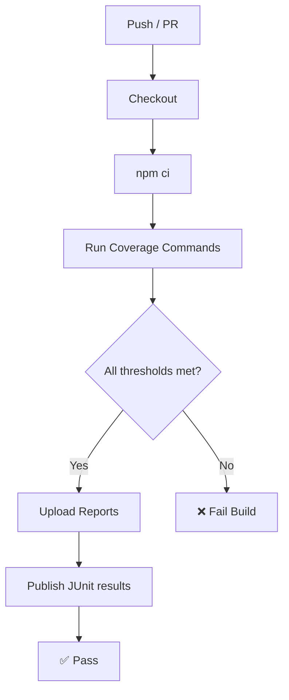

# CI/CD Integration

The analyzer is designed to slot into any CI pipeline. This guide covers GitHub Actions and Jenkins setups.

## GitHub Actions

An example workflow is provided at [`ci/examples/github-actions.yaml`](https://github.com/skaliber/apiTestsCoverageAnalyzer/blob/main/ci/examples/github-actions.yaml). Copy it to `.github/workflows/api-coverage.yaml` in your project.

```yaml
name: API Coverage Analysis

on:
  push:
    branches: [main, develop]
  pull_request:
    branches: [main]

jobs:
  api-coverage:
    name: Run API Test Coverage Analysis
    runs-on: ubuntu-latest

    steps:
      - uses: actions/checkout@v4

      - uses: actions/setup-node@v4
        with:
          node-version: '20'
          cache: 'npm'

      - run: npm ci

      - name: Endpoint coverage
        run: |
          node -r ts-node/register src/index.ts endpoint-coverage \
            --spec openapi.yaml \
            --tests "tests/**/*.ts" \
            --format json,html,csv,junit \
            --threshold-endpoint 80

      - name: Parameter coverage
        run: |
          node -r ts-node/register src/index.ts parameter-coverage \
            --spec openapi.yaml \
            --tests "tests/**/*.ts" \
            --format json,html \
            --threshold-parameter 70

      # ... add more coverage steps as needed

      - name: Upload reports
        if: always()
        uses: actions/upload-artifact@v4
        with:
          name: coverage-reports
          path: reports/
          retention-days: 30

      - name: Publish JUnit results
        if: always()
        uses: EnricoMi/publish-unit-test-result-action@v2
        with:
          junit_files: 'reports/coverage-summary-junit.xml'
          check_name: 'API Coverage Thresholds'
```

### Caching dependencies

The `cache: 'npm'` option on `actions/setup-node` automatically caches the `~/.npm` directory based on the `package-lock.json` hash. For monorepos with a `dashboard/` sub-package, add a second cache entry:

```yaml
- uses: actions/setup-node@v4
  with:
    node-version: '20'
    cache: 'npm'
    cache-dependency-path: |
      package-lock.json
      dashboard/package-lock.json
```

### Deploying docs to GitHub Pages

Add a separate job to build and publish the documentation site:

```yaml
  docs:
    name: Build & Deploy Docs
    runs-on: ubuntu-latest
    needs: api-coverage
    if: github.ref == 'refs/heads/main'
    permissions:
      pages: write
      id-token: write
    environment:
      name: github-pages
      url: ${{ steps.deployment.outputs.page_url }}
    steps:
      - uses: actions/checkout@v4
      - uses: actions/setup-node@v4
        with:
          node-version: '20'
          cache: 'npm'
      - run: npm ci
      - run: npm run docs:build
      - uses: actions/upload-pages-artifact@v3
        with:
          path: docs/.vitepress/dist
      - id: deployment
        uses: actions/deploy-pages@v4
```

## Jenkins Pipeline

An example `Jenkinsfile` is at [`ci/examples/jenkins-pipeline.groovy`](https://github.com/skaliber/apiTestsCoverageAnalyzer/blob/main/ci/examples/jenkins-pipeline.groovy). Key stages:

```groovy
pipeline {
  agent { label 'node20' }

  stages {
    stage('Install') {
      steps { sh 'npm ci' }
    }

    stage('Endpoint Coverage') {
      steps {
        sh '''
          node -r ts-node/register src/index.ts endpoint-coverage \
            --spec openapi.yaml \
            --tests "tests/**/*.ts" \
            --format json,html,junit \
            --threshold-endpoint 80
        '''
      }
    }

    stage('Archive Reports') {
      steps {
        archiveArtifacts artifacts: 'reports/**', fingerprint: true
        junit 'reports/coverage-summary-junit.xml'
      }
    }
  }
}
```

## Enforcing thresholds

When any threshold is exceeded the CLI exits with code **1**, causing the CI step to fail. Use `--threshold-*` flags or set them in `coverage.config.json`.

```json
{
  "thresholds": {
    "endpoint": 80,
    "parameter": 70,
    "business": 60,
    "integration": 50,
    "security": 60,
    "error": 50,
    "performance": 75,
    "resilience": 50
  }
}
```

## Integration flow



## Uploading HTML reports

The HTML reports are standalone files that can be served directly. Upload them as build artifacts and use a step to publish them to GitHub Pages, S3, or Netlify:

```bash
# Deploy to Netlify (requires netlify-cli)
netlify deploy --prod --dir reports/
```

## Next steps

- [Interpreting Reports →](/guide/interpreting-reports)
- [CLI Reference →](/reference/cli)
