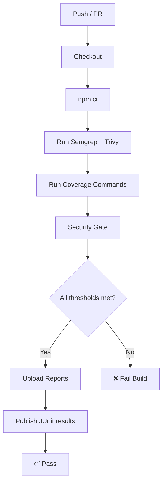

# CI/CD Integration

The analyzer is designed to slot into any CI pipeline. This guide covers GitHub Actions and Jenkins setups.

## GitHub Actions

An example workflow is provided at [`ci/examples/github-actions.yaml`](https://github.com/q-intel/apiTestsCoverageAnalyzer/blob/main/ci/examples/github-actions.yaml). Copy it to `.github/workflows/api-coverage.yaml` in your project.

```yaml
name: API Coverage Analysis

on:
  push:
    branches: [main, develop]
  pull_request:
    branches: [main]

jobs:
  api-coverage:
    name: Run API Test Coverage Analysis
    runs-on: ubuntu-latest

    steps:
      - uses: actions/checkout@v4

      - uses: actions/setup-node@v4
        with:
          node-version: '20'
          cache: 'npm'

      - run: npm ci

      # config.yaml at repo root controls all scan types, thresholds, and reporting.
      # Running `analyze` with no arguments runs the full default profile.
      - name: Run analysis
        run: analyze

      - name: Upload reports
        if: always()
        uses: actions/upload-artifact@v4
        with:
          name: coverage-reports
          path: reports/
          retention-days: 30

      - name: Publish JUnit results
        if: always()
        uses: EnricoMi/publish-unit-test-result-action@v2
        with:
          junit_files: 'reports/coverage-summary-junit.xml'
          check_name: 'API Coverage Thresholds'
```

### Caching dependencies

The `cache: 'npm'` option on `actions/setup-node` automatically caches the `~/.npm` directory based on the `package-lock.json` hash. For monorepos with a `dashboard/` sub-package, add a second cache entry:

```yaml
- uses: actions/setup-node@v4
  with:
    node-version: '20'
    cache: 'npm'
    cache-dependency-path: |
      package-lock.json
      dashboard/package-lock.json
```

### Deploying docs to GitHub Pages

Add a separate job to build and publish the documentation site:

```yaml
  docs:
    name: Build & Deploy Docs
    runs-on: ubuntu-latest
    needs: api-coverage
    if: github.ref == 'refs/heads/main'
    permissions:
      pages: write
      id-token: write
    environment:
      name: github-pages
      url: ${{ steps.deployment.outputs.page_url }}
    steps:
      - uses: actions/checkout@v4
      - uses: actions/setup-node@v4
        with:
          node-version: '20'
          cache: 'npm'
      - run: npm ci
      - run: npm run docs:build
      - uses: actions/upload-pages-artifact@v3
        with:
          path: docs/.vitepress/dist
      - id: deployment
        uses: actions/deploy-pages@v4
```

## Jenkins Pipeline

An example `Jenkinsfile` is at [`ci/examples/jenkins-pipeline.groovy`](https://github.com/q-intel/apiTestsCoverageAnalyzer/blob/main/ci/examples/jenkins-pipeline.groovy). Key stages:

```groovy
pipeline {
  agent { label 'node20' }

  stages {
    stage('Install') {
      steps { sh 'npm ci' }
    }

    stage('API Coverage') {
      steps {
        // config.yaml at workspace root controls all scan behaviour
        sh 'analyze'
      }
    }

    stage('Archive Reports') {
      steps {
        archiveArtifacts artifacts: 'reports/**', fingerprint: true
        junit 'reports/coverage-summary-junit.xml'
      }
    }
  }
}
```

## Enforcing thresholds

When any threshold is exceeded the CLI exits with code **1**, causing the CI step to fail. Set thresholds in `config.yaml`:

```yaml
thresholds:
  endpoint: 80
  parameter: 70
  business: 60
  integration: 50
  security: 60
  error: 50
  performance: 75
  resilience: 50

qualityGate:
  enabled: true
  failBuildOnThresholdMiss: true
```

The `--threshold-*` CLI flags are **deprecated**. Use `config.yaml` instead.

## Security scanning in CI

Add integrated scanner steps before the coverage gate to catch vulnerabilities, secrets, and misconfigurations:

```yaml
  - name: Run Semgrep SAST
    run: semgrep scan --json --config p/security-audit src/ > reports/semgrep.json
    continue-on-error: true   # let the gate decide pass/fail

  - name: Run Trivy dependency + secret scan
    run: |
      trivy fs --format json --scanners vuln,secret,misconfig \
        --output reports/trivy.json .

  - name: Enforce security gate
    run: |
      node dist/index.js security-scan \
        --semgrep-report reports/semgrep.json \
        --trivy-report   reports/trivy.json \
        --fail-on-critical \
        --fail-on-high \
        --max-secrets 0 \
        --max-medium 10

  - name: Upload security reports
    if: always()
    uses: actions/upload-artifact@v4
    with:
      name: security-reports
      path: |
        reports/security-scan-summary.json
        reports/security-scan-summary.html
        reports/security-sast.json
        reports/security-dependencies.json
        reports/security-secrets.json
        reports/security-ai-summary.md
      retention-days: 30
```

For ZAP dynamic scanning, run ZAP in a separate job (or Docker container) and import the report:

```yaml
  - name: ZAP baseline scan (staging)
    run: |
      docker run --rm -v $(pwd)/reports:/zap/wrk:rw \
        owasp/zap2docker-stable \
        zap-baseline.py -t https://staging.example.com -J /zap/wrk/zap.json
    continue-on-error: true

  - name: Import ZAP findings into security gate
    run: |
      node dist/index.js security-scan \
        --zap-report reports/zap.json \
        --fail-on-critical
```

See the [Security Scanning guide →](./security-scanning.md) for full configuration options.

## Integration flow



## Uploading HTML reports

The HTML reports are standalone files that can be served directly. Upload them as build artifacts and use a step to publish them to GitHub Pages, S3, or Netlify:

```bash
# Deploy to Netlify (requires netlify-cli)
netlify deploy --prod --dir reports/
```

## Next steps

- [Security Scanning →](./security-scanning.md)
- [Interpreting Reports →](./interpreting-reports.md)
- [CLI Reference →](../reference/cli.md)
