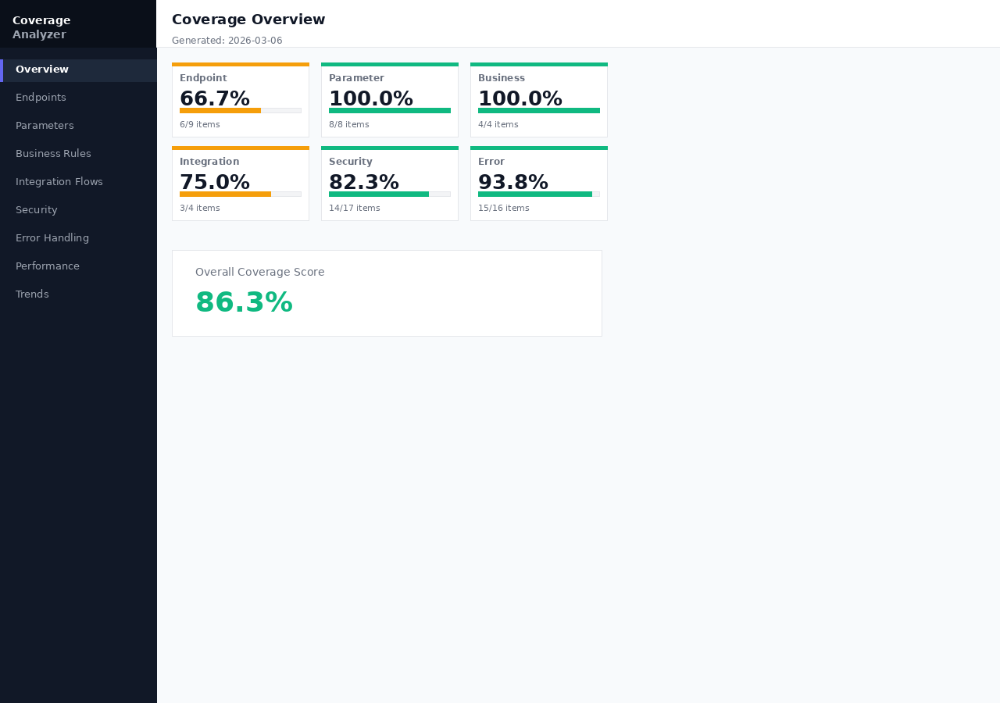
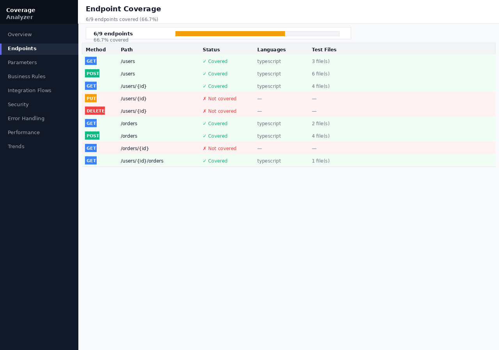
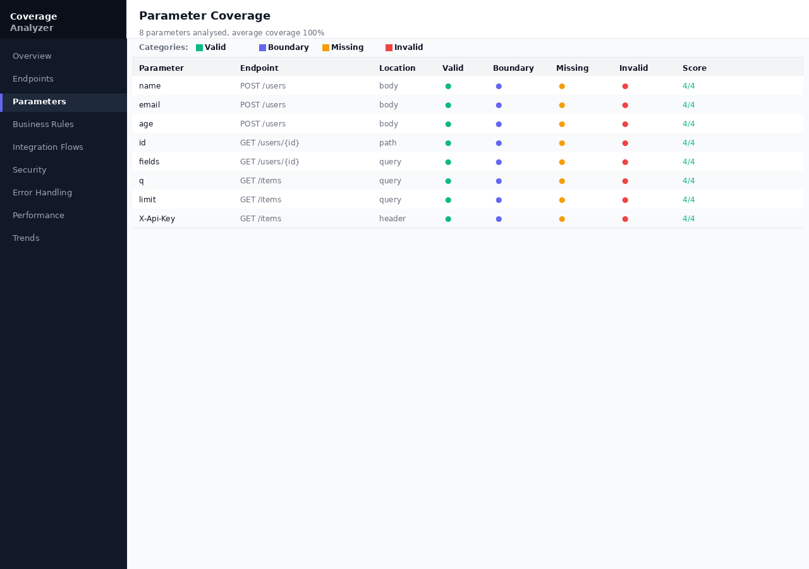
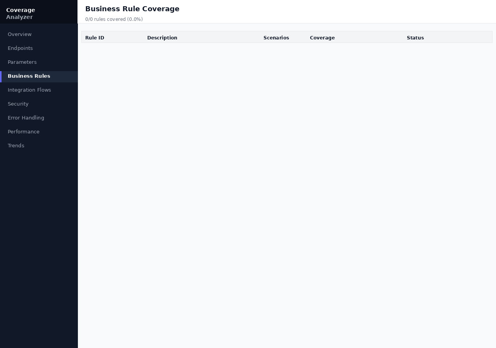
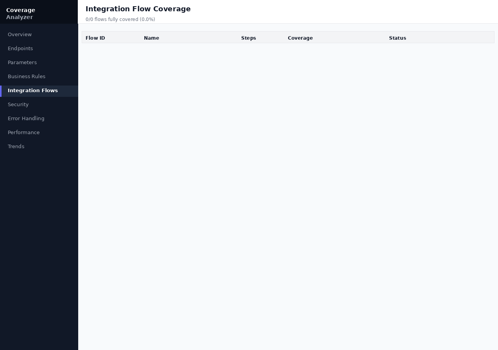
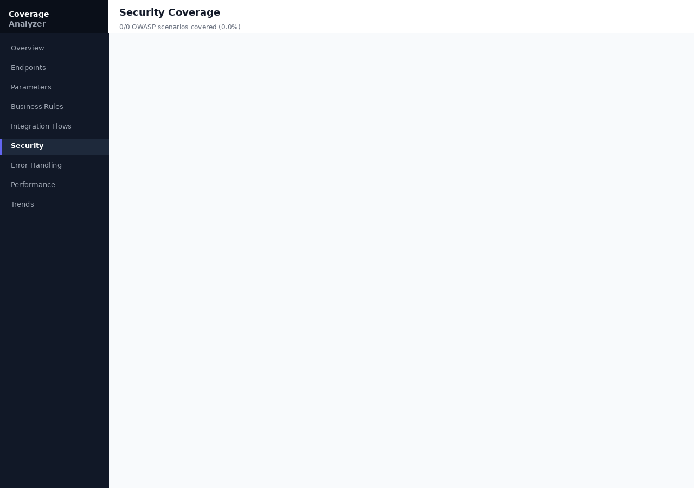
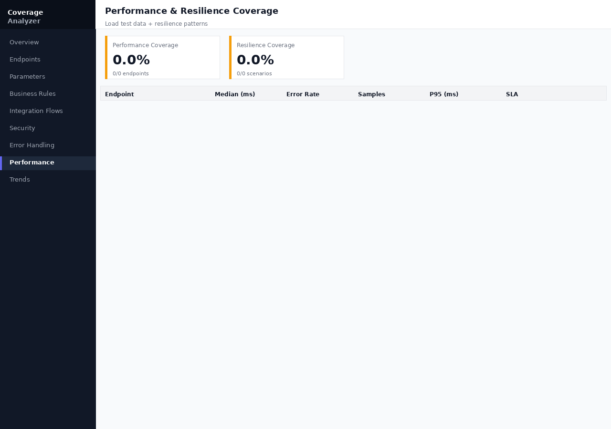

# Interpreting Reports

Each coverage command writes one or more output files to the `reports/` directory. This guide explains what each report contains and how to act on it.

**Dashboard view:**



## Report formats

| Format | File | Best for |
|--------|------|---------|
| JSON   | `reports/<type>-coverage.json` | Programmatic post-processing, dashboard ingestion |
| HTML   | `reports/<type>-coverage.html` | Human review, sharing with stakeholders |
| CSV    | `reports/<type>-coverage.csv`  | Spreadsheet analysis, trending |
| JUnit  | `reports/coverage-summary-junit.xml` | CI threshold enforcement (fail-fast) |

## JSON report structure

All JSON reports share a common envelope:

```json
{
  "type": "endpoint",          // coverage type
  "totalItems": 12,            // total items found in spec/rules
  "coveredItems": 10,          // items exercised by tests
  "coveragePercent": 83.33,    // coverage %
  "thresholdPassed": true,     // did we meet the threshold?
  "details": {
    "items": [
      {
        "id": "GET /users",
        "covered": true,
        "tests": ["should list users", "should paginate users"]
      }
    ]
  }
}
```

## Endpoint coverage

The endpoint report shows which `METHOD /path` combinations are exercised.

**Key fields to review:**

- `coveredItems` / `totalItems` – the headline number.
- `details.items[].covered: false` – the list of **untested endpoints**. These are your coverage gaps.
- `details.items[].tests` – which test descriptions hit this endpoint.

**Dashboard view:**



**Action:** For each uncovered endpoint, either:
1. Write a test that calls the endpoint, or
2. Add the path to an exclusion list via CLI `--exclude-paths` if it is intentionally not tested.

## Parameter coverage

Parameter reports break coverage into four categories:

| Category | Description |
|----------|-------------|
| `valid`    | At least one test sends a valid value |
| `boundary` | Tests around edge values (min/max, empty string, etc.) |
| `missing`  | Tests that omit the parameter (check required-field validation) |
| `invalid`  | Tests that send a value of the wrong type or format |

**Dashboard view:**



**Action:** A parameter with only `valid: true` and others `false` is a red flag – add boundary, missing, and invalid tests.

## Business rule coverage

Business rules are defined in `business-rules.yaml`. Each rule has one or more *scenarios* (sub-rules). Coverage is measured per rule and per scenario.

```yaml
rules:
  - id: discount-eligibility
    description: Users with more than 5 orders get a 10% discount
    scenarios:
      - id: first-time-buyer
        description: No discount for first purchase
      - id: repeat-buyer
        description: 10% discount after 5th order
```

In your tests, annotate with `@businessRule discount-eligibility/repeat-buyer` in the test description:

```typescript
it('applies 10% discount after 5th order @businessRule discount-eligibility/repeat-buyer', async () => {
  // ...
})
```

**Dashboard view:**



## Integration flow coverage

Integration flows describe multi-step user journeys. Each step must be exercised in order for the flow to be "covered."

```yaml
flows:
  - id: user-checkout
    steps:
      - GET /users/{id}
      - POST /orders
      - GET /orders/{id}
      - POST /payments
```

Use the `@flow user-checkout` annotation to associate a test with a flow:

```typescript
it('completes checkout flow @flow user-checkout', async () => {
  // must exercise all four steps
})
```

**Dashboard view:**



## Security coverage

Security coverage checks for OWASP Top-10 related scenarios grouped into categories:

| Category | Examples |
|----------|---------|
| Authentication | Missing/invalid token, expired token |
| Authorisation | IDOR, privilege escalation, role mismatch |
| Injection | SQL injection, XSS, path traversal in inputs |
| Rate limiting | Repeated requests, DDoS simulation |
| Data exposure | PII in response, verbose error messages |

**Dashboard view:**



## Error handling coverage

The error report groups test scenarios by HTTP status-code range:

| Range | Category |
|-------|----------|
| 4xx (client errors) | invalid input, auth failures, not found |
| 5xx (server errors) | upstream failures, timeouts, panics |
| Validation errors | schema validation, required fields |
| Timeout/circuit-breaker | downstream dependency failures |

## Performance & resilience coverage

Two sub-reports are generated:

1. **Performance** – cross-references load-test results (JMeter/k6) with spec endpoints:
   - Red: median response time > threshold (default 500 ms) or error rate > threshold (default 5%)
   - Green: within thresholds

2. **Resilience** – checks for resilience scenarios in tests:
   - retry logic, circuit breaker, timeout handling, bulkhead, fallback

**Dashboard view:**



## Compatibility report

Compares two OpenAPI spec versions and lists breaking changes:

- Removed paths
- Changed response schemas (incompatible type changes)
- Changed required parameters
- Contract violations (Pact)

**Action:** Any breaking change requires either a major version bump or a fix before merging.

## Trend report

The Trends page in the dashboard plots coverage percentages over time. To populate it, point the dashboard at a directory of JSON reports from multiple CI runs:

```
reports/
├── 2024-01-15-endpoint-coverage.json
├── 2024-01-16-endpoint-coverage.json
└── ...
```

## Markdown summary report

Generate a human-readable summary of all reports:

```bash
node dist/index.js generate-md-report \
  --reports "reports/*.json" \
  --output reports/summary.md
```

This is useful for including in PR descriptions or Confluence pages.

## Next steps

- [Writing Effective Tests →](./writing-tests.md)
- [CLI Reference →](../reference/cli.md)
