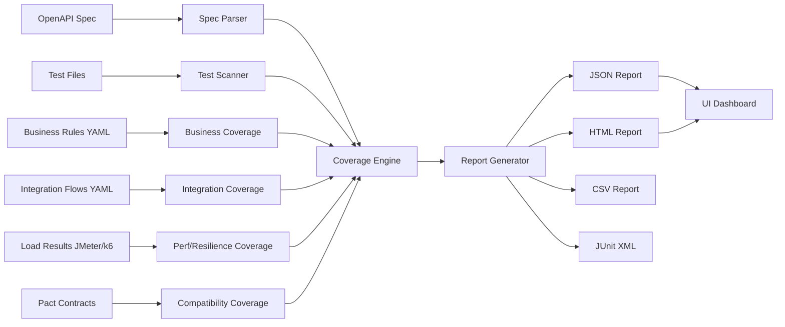

# What is the API Test Coverage Analyzer?

The **API Test Coverage Analyzer** is an open-source CLI tool that measures how thoroughly your test suite exercises your API surface area. Rather than simply counting passing tests, it asks deeper questions:

- Are all **endpoints** reachable via at least one test?
- Are **parameters** tested with valid, boundary, missing, and invalid values?
- Are **business rules** (discount logic, rate limiting, etc.) explicitly validated?
- Do **integration flows** (multi-step user journeys) run end-to-end?
- Are **security scenarios** (auth bypass, injection, IDOR) covered?
- Do **error paths** (4xx/5xx) behave correctly?
- Is there **performance and resilience** evidence (JMeter/k6 data)?
- Does the API **remain compatible** between versions?

The answers appear in rich HTML, JSON, CSV, and JUnit reports that can be enforced as pass/fail gates in any CI pipeline.

## Problems it solves

| Problem | How the analyzer helps |
|---------|----------------------|
| "We have 90% code coverage but our API still breaks" | Maps tests directly to API surface, not just lines of code |
| "We don't know which endpoints are untested" | Endpoint coverage report with gap highlighting |
| "Our business rules are undocumented and untested" | Declarative YAML rules linked to test descriptions |
| "We broke a consumer last release" | Compatibility check between spec versions + Pact contract verification |
| "CI passes but prod goes slow under load" | Integrates load-test results (JMeter/k6) as part of coverage |
| "Our plugin/extension is hard to integrate" | Typed plugin interface – ship a new coverage type as a single JS file |

## Key features

- **Multi-language test suites** – analyse tests written in TypeScript, JavaScript, Java, Kotlin, Python, Ruby, and Cucumber/Gherkin.
- **Zero test-framework lock-in** – reads plain `.test.ts` / `.test.js` files; works with Jest, Mocha, Vitest, and any other runner.
- **OpenAPI 3.x and Swagger 2.x** support via `@apidevtools/swagger-parser`.
- **Multiple output formats** – JSON, HTML (interactive), CSV, JUnit XML for CI.
- **Configurable thresholds** – fail the build when coverage drops below your targets.
- **Exclusions** – ignore internal or third-party paths via glob patterns.
- **Plugin system** – add new coverage dimensions without modifying the core tool.
- **Observability** – Prometheus metrics, Pino structured logging, and OpenTelemetry tracing built-in.
- **UI Dashboard** – a Vite + React app that visualises all coverage reports in one place.

## Architecture overview

## Next steps

- [Install the tool →](./installation.md)
- [Run your first analysis →](./getting-started.md)
- [Explore the CLI reference →](../reference/cli.md)
