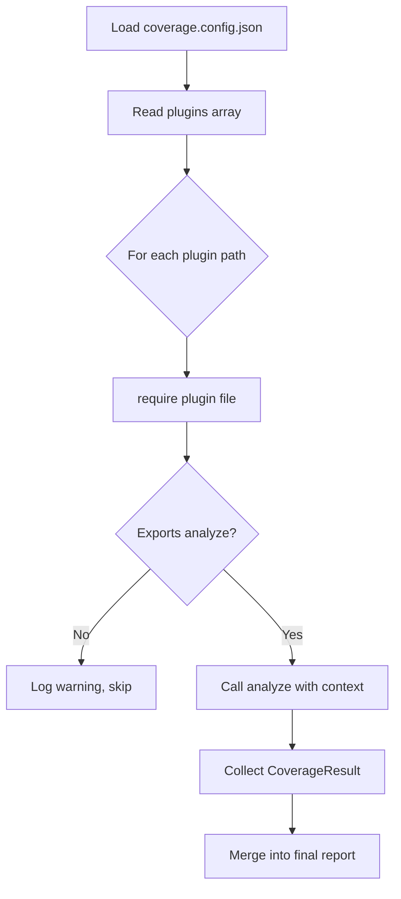

# Extending via Plugins

The analyzer ships with a plugin architecture that lets you add entirely new coverage dimensions without modifying the core tool. Plugins are plain JavaScript (or TypeScript-compiled) files that export an `analyze` function.

## When to use a plugin

- Your API uses a protocol not covered by the built-in commands (GraphQL, gRPC, WebSocket, …).
- You want to check custom internal conventions (e.g. "every endpoint must have an `X-Request-ID` header test").
- You want to integrate a third-party coverage tool and surface its results in the analyzer report.

## Plugin interface

```typescript
interface PluginContext {
  spec: object          // parsed OpenAPI spec (SwaggerParser output)
  testPatterns: string[] // glob patterns to locate test files
  results: CoverageResult[] // built-in coverage results already computed
  config: CoverageConfig    // full resolved configuration
}

interface Plugin {
  analyze(context: PluginContext): Promise<CoverageResult>
}

interface CoverageResult {
  type: string          // unique identifier for this coverage type
  totalItems: number
  coveredItems: number
  coveragePercent: number
  details: Record<string, unknown>
}
```

## Writing a plugin

### 1. Create the plugin file

```javascript
// plugins/my-custom-coverage.js
'use strict'

const fs = require('fs')
const glob = require('fast-glob')

async function analyze({ testPatterns, config }) {
  // 1. Discover the items you want to measure (e.g. your custom spec format)
  const allItems = ['item-a', 'item-b', 'item-c']

  // 2. Scan test files for coverage evidence
  const cwd = process.cwd()
  const testFiles = await glob(testPatterns, { cwd, absolute: true })
  const testContents = testFiles.map(f => {
    try { return fs.readFileSync(f, 'utf-8') } catch { return '' }
  })

  // 3. Compute coverage
  const coveredItems = allItems.filter(item =>
    testContents.some(content => content.includes(item))
  )

  return {
    type: 'my-custom',               // unique type name
    totalItems: allItems.length,
    coveredItems: coveredItems.length,
    coveragePercent: allItems.length > 0
      ? parseFloat(((coveredItems.length / allItems.length) * 100).toFixed(2))
      : 0,
    details: {
      items: allItems.map(id => ({
        id,
        covered: coveredItems.includes(id),
      })),
    },
  }
}

module.exports = { analyze }
```

### 2. Register the plugin in `coverage.config.json`

```json
{
  "plugins": ["./plugins/my-custom-coverage.js"]
}
```

### 3. Run any coverage command

Plugins are loaded and run automatically for every coverage command. Their results appear in the JSON reports under the `plugins` key.

## GraphQL plugin example

A fully worked example is included at [`plugins/graphql-coverage.js`](https://github.com/q-intel/apiTestsCoverageAnalyzer/blob/main/plugins/graphql-coverage.js). It:

1. Reads a `schema.graphql` file from the project root.
2. Parses all types and fields using a lightweight regex-based SDL parser (no `graphql` package dependency).
3. Scans test files for `gql` template literals and extracts queried field names.
4. Returns a `CoverageResult` with `type: "graphql"`.

## Plugin loading flow



## Plugin tips

- Use `fast-glob` (already a dependency) for file scanning – it works in CommonJS and is fast.
- Keep the plugin zero-dependency beyond what is already in the project.
- Return `coveragePercent: 0` with a descriptive `details.message` if the plugin cannot find its input (e.g. no `schema.graphql`) rather than throwing.
- Use `config.testPatterns` as the default glob patterns so users can override them.

## Publishing a plugin on npm

If you want to share your plugin, publish it as an npm package. Name it `api-coverage-analyzer-plugin-<name>`:

```bash
npm publish --access public
```

Users install it and reference it by module name in `coverage.config.json`:

```json
{
  "plugins": ["api-coverage-analyzer-plugin-grpc"]
}
```

## Next steps

- [Configuration Schema →](../reference/configuration.md)
- [Plugin API →](../reference/plugin-api.md)
