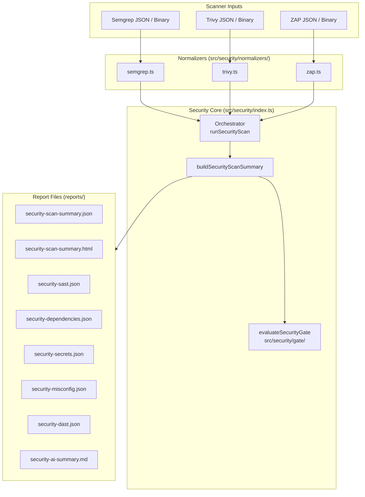
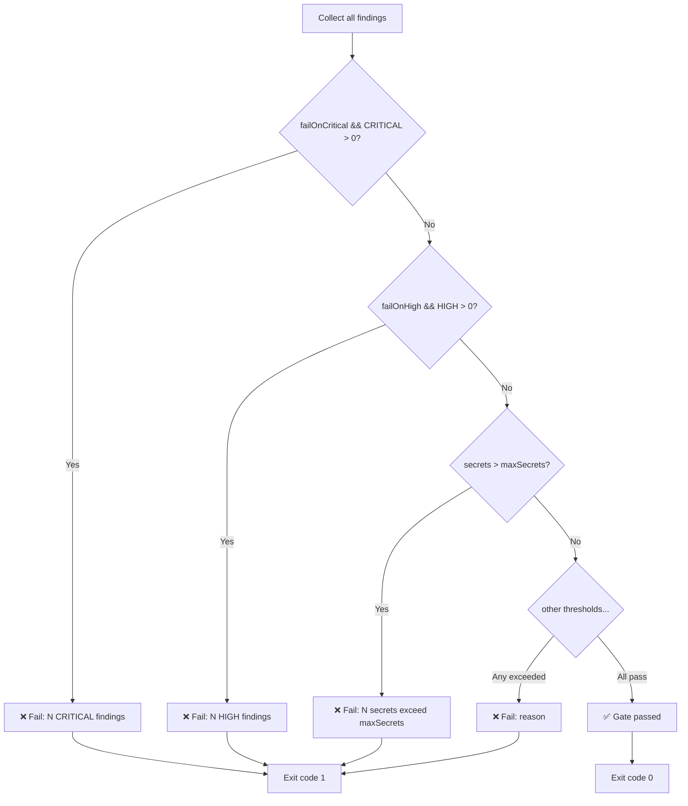
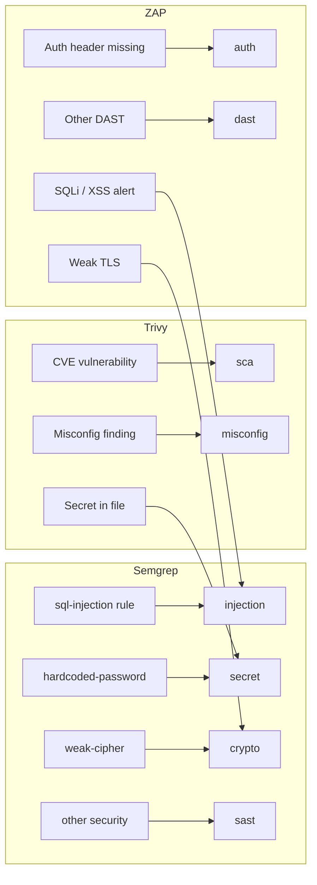
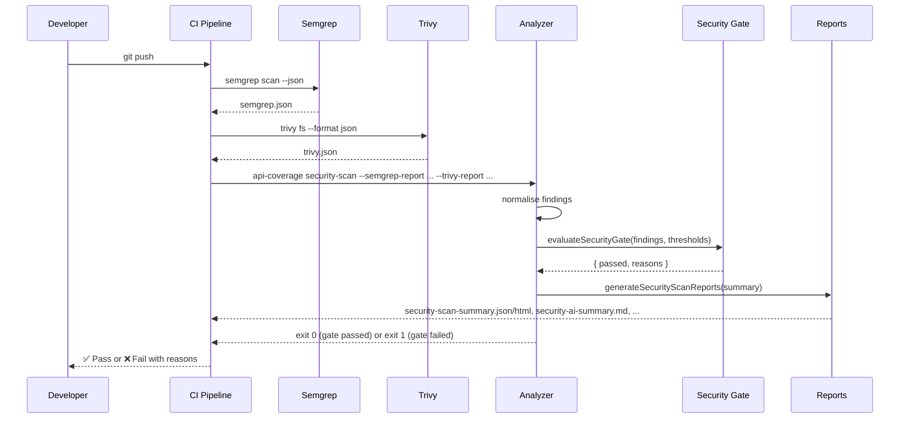
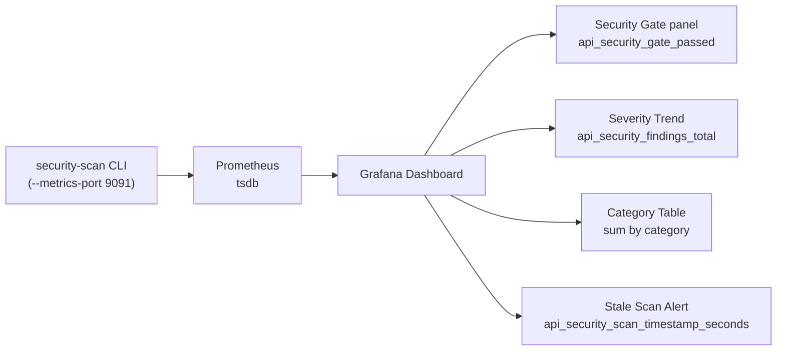

# Security Scanning

The analyzer integrates three best-in-class open-source scanners and merges their findings into a unified security posture report with a configurable quality gate.

## Supported scanners

| Scanner | Purpose | Modes |
|---------|---------|-------|
| **Semgrep** | SAST – code pattern detection, injection, secrets in code | embedded, import |
| **Trivy** | SCA – dependency vulns, secrets, IaC misconfigurations | embedded, import |
| **OWASP ZAP** | DAST – runtime API scanning against a live target | embedded, import |

All scanner outputs are normalized into a single `SecurityFinding` model so you never need to parse raw Semgrep, Trivy, or ZAP JSON yourself.

## Architecture



## Scanner modes

Each scanner supports three modes:

| Mode | Description | When to use |
|------|-------------|-------------|
| `embedded` | The analyzer invokes the scanner binary directly | CI environments where the binary is installed |
| `import` | The analyzer reads a pre-generated JSON report | When you already run the scanner elsewhere in the pipeline |
| `disabled` | Scanner is skipped entirely | — |

## CLI quickstart

### Import mode (most common in CI)

Run your scanners separately and pass the report files:

```bash
# Run Semgrep and save report
semgrep scan --json --config p/security-audit src/ > reports/semgrep.json

# Run Trivy and save report
trivy fs --format json --scanners vuln,secret,misconfig . > reports/trivy.json

# Import both reports and enforce the security gate
api-coverage security-scan \
  --semgrep-report reports/semgrep.json \
  --trivy-report   reports/trivy.json \
  --fail-on-critical \
  --fail-on-high \
  --max-secrets 0 \
  --max-medium 10
```

### Embedded mode

Let the analyzer invoke the scanner binaries itself:

```bash
api-coverage security-scan \
  --workspace . \
  --semgrep \
  --semgrep-config p/default \
  --trivy \
  --trivy-scanners vuln,secret,misconfig \
  --fail-on-critical \
  --max-secrets 0
```

### ZAP dynamic scan

Import a ZAP report generated against a live environment:

```bash
# Run ZAP baseline scan (separate step in your pipeline)
zap-baseline.py -t https://staging.example.com -J reports/zap.json

# Merge ZAP findings into the security gate
api-coverage security-scan \
  --zap-report reports/zap.json \
  --fail-on-critical
```

## Security gate

The gate evaluates all normalized findings against thresholds and exits with code **1** if any threshold is breached.

### Available thresholds

| CLI flag | Description | Example |
|----------|-------------|---------|
| `--fail-on-critical` | Fail if any CRITICAL finding exists | `--fail-on-critical` |
| `--fail-on-high` | Fail if any HIGH finding exists | `--fail-on-high` |
| `--max-medium <n>` | Maximum allowed MEDIUM findings | `--max-medium 10` |
| `--max-secrets <n>` | Maximum allowed secrets (any severity) | `--max-secrets 0` |
| `--max-misconfig-high <n>` | Maximum HIGH/CRITICAL misconfigs | `--max-misconfig-high 0` |
| `--max-critical-vulns <n>` | Maximum CRITICAL dependency vulns | `--max-critical-vulns 0` |
| `--max-high-vulns <n>` | Maximum HIGH dependency vulns | `--max-high-vulns 5` |

### Gate decision flow



## Normalized finding model

Every scanner's output is mapped to this common schema:

```typescript
type SecurityFinding = {
  scanner: 'semgrep' | 'trivy' | 'zap' | 'gitleaks' | 'other';
  category:
    | 'sast' | 'sca' | 'secret' | 'misconfig' | 'dast'
    | 'auth' | 'injection' | 'data-exposure' | 'crypto' | 'unknown';
  severity: 'LOW' | 'MEDIUM' | 'HIGH' | 'CRITICAL';
  title: string;
  description?: string;
  ruleId?: string;
  cwe?: string[];
  cve?: string[];
  owasp?: string[];
  filePath?: string;
  lineStart?: number;
  lineEnd?: number;
  endpoint?: { method?: string; path?: string };
  packageName?: string;
  installedVersion?: string;
  fixedVersion?: string;
  secretType?: string;
};
```

### Category mappings



## Semgrep integration

### Embedded mode

```bash
api-coverage security-scan \
  --semgrep \
  --semgrep-config p/security-audit \
  --workspace src/
```

The analyzer runs: `semgrep scan --json --config p/security-audit src/`

### Import mode

```bash
# Generate Semgrep report externally
semgrep scan --json --config p/default --config p/owasp-top-ten . > semgrep.json

# Import it
api-coverage security-scan --semgrep-report semgrep.json
```

### Severity mapping

| Semgrep native | Normalized |
|---------------|-----------|
| `CRITICAL` | `CRITICAL` |
| `ERROR` | `HIGH` |
| `WARNING` | `MEDIUM` |
| `INFO` / `NOTE` | `LOW` |

### Rule selection tips

```bash
# Security audit pack (recommended)
semgrep scan --config p/security-audit .

# OWASP Top 10
semgrep scan --config p/owasp-top-ten .

# Language-specific
semgrep scan --config p/java .
semgrep scan --config p/python .

# Custom rules directory
semgrep scan --config ./security-rules/ .

# Multiple configs
semgrep scan --config p/default --config p/secrets .
```

## Trivy integration

### Embedded mode

```bash
api-coverage security-scan \
  --trivy \
  --trivy-scanners vuln,secret,misconfig \
  --workspace .
```

The analyzer runs: `trivy fs --format json --scanners vuln,secret,misconfig .`

### Import mode

```bash
# Generate Trivy report
trivy fs --format json --scanners vuln,secret,misconfig . > trivy.json

# Import it
api-coverage security-scan --trivy-report trivy.json
```

### Scanner combinations

| `--trivy-scanners` | What is scanned |
|-------------------|----------------|
| `vuln` | Dependency vulnerabilities from lock files |
| `secret` | Hardcoded secrets and credentials |
| `misconfig` | IaC misconfigurations (Dockerfile, k8s manifests, Terraform) |
| `vuln,secret` | Both vulnerabilities and secrets (default) |
| `vuln,secret,misconfig` | Full scan |

### Severity mapping

| Trivy native | Normalized |
|-------------|-----------|
| `CRITICAL` | `CRITICAL` |
| `HIGH` | `HIGH` |
| `MEDIUM` | `MEDIUM` |
| `LOW` / `UNKNOWN` | `LOW` |

## OWASP ZAP integration

ZAP is used for dynamic API scanning against a running service. The recommended approach is **import mode** — run ZAP in your pipeline and import the report.

### Import mode

```bash
# Run ZAP baseline scan (in a Docker step or separate job)
docker run -t owasp/zap2docker-stable \
  zap-baseline.py -t https://staging.example.com \
  -J /zap/wrk/zap.json

# Import and gate
api-coverage security-scan \
  --zap-report zap.json \
  --fail-on-critical
```

### ZAP report format

The normalizer accepts ZAP reports in both common formats:

**Standard site format** (ZAP default):
```json
{
  "site": [{
    "alerts": [
      { "alert": "SQL Injection", "riskdesc": "High (High)", "uri": "https://..." }
    ]
  }]
}
```

**Flat format**:
```json
{
  "alerts": [
    { "name": "Cross Site Scripting", "riskdesc": "High (High)" }
  ]
}
```

## Generated reports

After running `security-scan`, the following files are written to the `reports/` directory:

| File | Contents |
|------|---------|
| `security-scan-summary.json` | Aggregated counts by severity, category, scanner; gate result |
| `security-scan-summary.html` | Interactive HTML summary with color-coded finding table |
| `security-sast.json` | Semgrep + injection findings |
| `security-dependencies.json` | Trivy SCA/vulnerability findings |
| `security-secrets.json` | Secret findings from Trivy (and Semgrep) |
| `security-misconfig.json` | Misconfiguration findings |
| `security-dast.json` | ZAP DAST findings |
| `security-ai-summary.md` | AI-friendly Markdown with gate status, top risks, remediation order |

### AI summary example

```markdown
# Security Scan AI Summary

## Scanners Executed
- semgrep
- trivy

## Security Gate
**Status:** ❌ FAILED

**Failure reasons:**
- 1 CRITICAL finding(s) found (failOnCritical=true)
- 2 secret(s) found, exceeds maxSecrets=0

## Recommended Remediation Order

1. **Secrets** — revoke and rotate immediately (2 found)
2. **Critical Vulnerabilities** — patch or mitigate (1 found)
3. **Auth Flaws** — fix authentication/authorization issues (0 found)
...
```

## Library API

Use the security scanning layer directly in your Node.js scripts:

```typescript
import {
  runSecurityAnalysis,
  evaluateSecurityGate,
  normalizeSemgrepOutput,
  normalizeTrivyOutput,
  normalizeZapOutput,
} from 'api-test-coverage-analyzer';

// Full scan workflow
const summary = await runSecurityAnalysis({
  config: {
    enabled: true,
    workspace: '.',
    scanners: {
      semgrep: {
        enabled: true,
        mode: 'import',
        reportPath: 'reports/semgrep.json',
      },
      trivy: {
        enabled: true,
        mode: 'import',
        reportPath: 'reports/trivy.json',
        scanners: ['vuln', 'secret', 'misconfig'],
      },
      zap: {
        enabled: true,
        mode: 'import',
        reportPath: 'reports/zap.json',
      },
    },
    gate: {
      failOnCritical: true,
      failOnHigh: false,
      maxMedium: 10,
      maxSecrets: 0,
      maxMisconfigHigh: 0,
      maxCriticalVulns: 0,
      maxHighVulns: 5,
    },
  },
  reportsDir: 'reports',
});

console.log(`Total findings: ${summary.totalFindings}`);
console.log(`Gate passed: ${summary.gateResult?.passed}`);

// Evaluate the gate separately
import * as fs from 'fs';
const trivyRaw = JSON.parse(fs.readFileSync('trivy.json', 'utf-8'));
const findings = normalizeTrivyOutput(trivyRaw);

const gateResult = evaluateSecurityGate(findings, {
  failOnCritical: true,
  maxSecrets: 0,
});

if (!gateResult.passed) {
  console.error('Security gate failed:');
  gateResult.reasons.forEach(r => console.error('  -', r));
  process.exit(1);
}
```

## GitHub Action

Add security scanning to your workflow with a few lines:

```yaml
- name: Run Semgrep SAST
  run: semgrep scan --json --config p/security-audit src/ > reports/semgrep.json
  continue-on-error: true

- name: Run Trivy dependency + secret scan
  run: trivy fs --format json --scanners vuln,secret . > reports/trivy.json

- name: Enforce security gate
  uses: q-intel/apiTestsCoverageAnalyzer@main
  with:
    coverage-types: 'security-scan'
    semgrep-report: 'reports/semgrep.json'
    trivy-report:   'reports/trivy.json'
    fail-on-critical: 'true'
    max-secrets: '0'
    max-medium: '10'
```

See [CI/CD Integration →](./ci-cd.md) for a full workflow example.

## Configuration reference

Full `config.yaml` example with security scanning:

```json
{
  "security": {
    "enabled": true,
    "workspace": ".",
    "scanners": {
      "semgrep": {
        "enabled": true,
        "mode": "import",
        "config": "p/default",
        "reportPath": "reports/semgrep.json",
        "include": ["src/**"],
        "exclude": ["dist/**", "node_modules/**"]
      },
      "trivy": {
        "enabled": true,
        "mode": "import",
        "scanMode": "fs",
        "scanners": ["vuln", "misconfig", "secret"],
        "reportPath": "reports/trivy.json"
      },
      "zap": {
        "enabled": false,
        "mode": "import",
        "reportPath": "reports/zap.json"
      }
    },
    "gate": {
      "failOnCritical": true,
      "failOnHigh": true,
      "maxMedium": 10,
      "maxSecrets": 0,
      "maxCriticalVulns": 0,
      "maxHighVulns": 0
    }
  }
}
```

## End-to-end workflow



## Prometheus metrics and Grafana

Every `security-scan` run records the following Prometheus metrics, which Grafana can query for long-term trend tracking.

### Exposed metrics

| Metric | Labels | Description |
|--------|--------|-------------|
| `api_security_findings_total` | `service`, `severity`, `category`, `scanner` | Number of findings per label combination |
| `api_security_gate_passed` | `service` | `1` = passed, `0` = failed, `-1` = not configured |
| `api_security_scan_timestamp_seconds` | `service` | Unix timestamp of the last completed scan |

These metrics are registered alongside the existing coverage metrics (`api_coverage_ratio`, etc.) in the same Prometheus registry and exposed on the same `--metrics-port`.

### Enabling metrics

Add `--metrics-port` to your `security-scan` command to expose metrics after each run:

```bash
node dist/index.js security-scan \
  --semgrep-report reports/semgrep.json \
  --trivy-report   reports/trivy.json \
  --fail-on-critical \
  --max-secrets 0 \
  --metrics-port 9091 \
  --service-name my-api
```

Prometheus will scrape `http://localhost:9091/metrics` and receive output like:

```
# HELP api_security_findings_total Number of security scan findings labeled by severity, category and scanner
# TYPE api_security_findings_total gauge
api_security_findings_total{service="my-api",severity="CRITICAL",category="sca",scanner="trivy"} 2
api_security_findings_total{service="my-api",severity="HIGH",category="sast",scanner="semgrep"} 5
api_security_findings_total{service="my-api",severity="MEDIUM",category="sast",scanner="semgrep"} 12
api_security_findings_total{service="my-api",severity="LOW",category="misconfig",scanner="trivy"} 8
api_security_findings_total{service="my-api",severity="HIGH",category="secret",scanner="trivy"} 0

# HELP api_security_gate_passed 1 if the security gate passed on the last scan, 0 if it failed, -1 if not configured
# TYPE api_security_gate_passed gauge
api_security_gate_passed{service="my-api"} 0

# HELP api_security_scan_timestamp_seconds Unix timestamp (seconds) of the last security scan run
# TYPE api_security_scan_timestamp_seconds gauge
api_security_scan_timestamp_seconds{service="my-api"} 1741215600
```

### Useful PromQL queries

```promql
# CRITICAL and HIGH findings over time
sum(api_security_findings_total{severity=~"CRITICAL|HIGH"}) by (service)

# Gate pass rate (1 = always passing, 0 = currently failing)
api_security_gate_passed

# Secrets trend
sum(api_security_findings_total{category="secret"}) by (service)

# Findings by scanner
sum by (scanner) (api_security_findings_total{service="my-api"})

# Time since last scan (in hours)
(time() - api_security_scan_timestamp_seconds) / 3600
```

### Grafana dashboard

The pre-built Grafana dashboard (`observability/grafana-dashboard.json`) includes a **Security Scanning** section with:

| Panel | Type | Description |
|-------|------|-------------|
| Security Gate | Stat (colored) | Green = PASSED, Red = FAILED |
| CRITICAL Findings | Stat | Red background if > 0 |
| HIGH Findings | Stat | Orange background if > 0 |
| Secrets Found | Stat | Red background if > 0 |
| Total Security Findings | Stat | Color-coded by threshold |
| Last Scan | Stat | Human-readable "X minutes ago" |
| Security Findings by Severity — Trend | Time series | CRITICAL/HIGH/MEDIUM/LOW over time |
| Security Findings by Category | Table | Counts per category (sast, sca, secret, …) |
| Security Findings by Scanner | Table | Counts per scanner (semgrep, trivy, zap) |

To import the dashboard:
1. Start the local Prometheus + Grafana stack: `docker-compose -f observability/docker-compose.yml up -d`
2. Open Grafana at `http://localhost:3000` (admin/admin)
3. Go to **Dashboards → Import**
4. Upload `observability/grafana-dashboard.json`



### Prometheus alerting rules

The `alerts/prometheus-rules.yml` file contains the following security-specific alerting rules:

| Alert | Severity | Trigger |
|-------|----------|---------|
| `SecurityGateFailed` | critical | `api_security_gate_passed == 0` |
| `SecurityCriticalFindingsDetected` | critical | Any CRITICAL finding |
| `SecurityHighFindingsDetected` | warning | Any HIGH finding |
| `SecuritySecretsDetected` | critical | Any secret finding |
| `SecurityScanStale` | warning | No scan in >24 h |
| `SecurityFindingsIncreasing` | warning | CRITICAL+HIGH count grew by >2 in 1 h |

Enable these rules by pointing Prometheus at the rule file (already configured in `observability/prometheus.yml`):

```yaml
rule_files:
  - "../alerts/prometheus-rules.yml"
```

## Next steps

- [CLI Reference → `security-scan`](../reference/cli.md#security-scan)
- [CI/CD Integration →](./ci-cd.md)
- [Architecture →](../reference/architecture.md)
