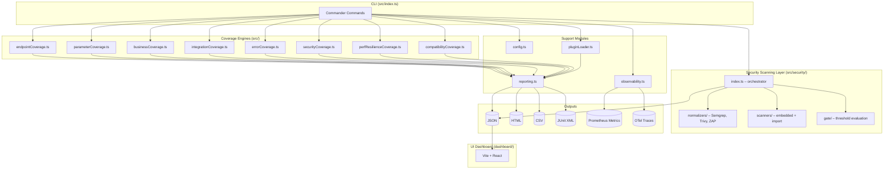
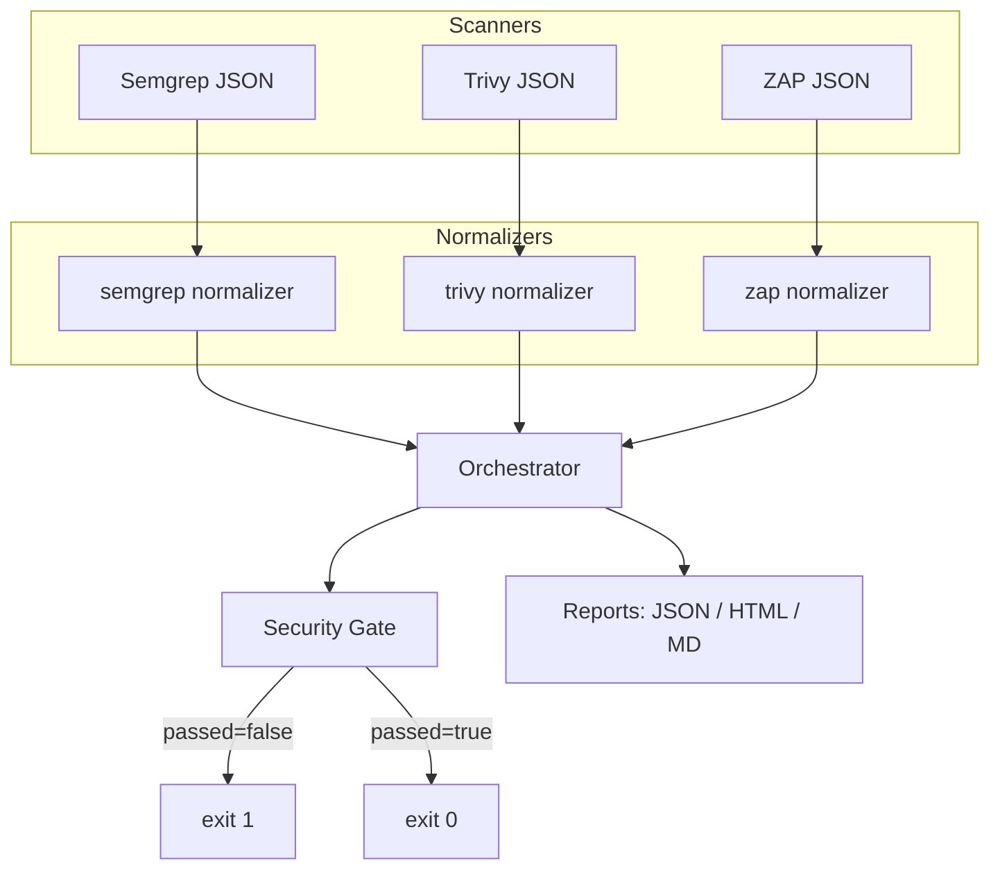
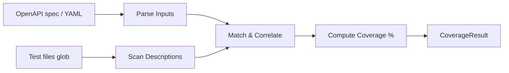
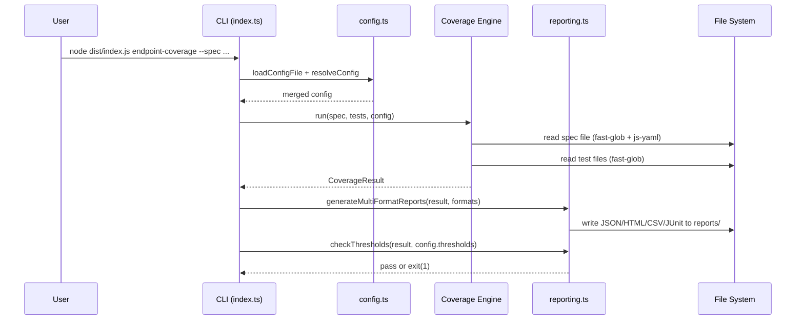

# Architecture

This document describes the major components of the API Test Coverage Analyzer and how they interact.

## Overview



## Directory structure

```
apiTestsCoverageAnalyzer/
├── src/
│   ├── index.ts                  # CLI entry point (Commander)
│   ├── endpointCoverage.ts       # Endpoint coverage engine
│   ├── parameterCoverage.ts      # Parameter coverage engine
│   ├── businessCoverage.ts       # Business rule coverage engine
│   ├── integrationCoverage.ts    # Integration flow coverage engine
│   ├── errorCoverage.ts          # Error handling coverage engine
│   ├── securityCoverage.ts       # Security test-heuristic coverage engine
│   ├── perfResilienceCoverage.ts # Performance & resilience engine
│   ├── compatibilityCoverage.ts  # Compatibility & contract engine
│   ├── security/                 # Integrated scanner layer (Spec 16)
│   │   ├── index.ts              #   Orchestrator + report generation
│   │   ├── types.ts              #   SecurityFinding, gate config, etc.
│   │   ├── scanners/             #   semgrep.ts, trivy.ts, zap.ts
│   │   ├── normalizers/          #   semgrep.ts, trivy.ts, zap.ts
│   │   └── gate/                 #   index.ts – threshold evaluation
│   ├── config.ts                 # Configuration loading & merging
│   ├── reporting.ts              # Multi-format report generation
│   ├── pluginLoader.ts           # Plugin loading & execution
│   └── observability.ts          # Logging, metrics, tracing
├── tests/                        # Jest unit tests for src/
├── dashboard/                    # Vite + React UI dashboard
├── plugins/                      # Sample and user plugins
├── sample/                       # Example spec, tests, contracts, load results
├── docs/                         # This documentation site (VitePress)
├── ci/                           # CI/CD example configs
├── observability/                # Docker Compose + Grafana dashboard
├── alerts/                       # Prometheus alerting rules
├── coverage.config.json          # Default configuration
├── tsconfig.json                 # TypeScript compiler config
├── jest.config.js                # Jest test runner config
└── package.json
```

## Module descriptions

### `src/index.ts` – CLI entry point

Built on [Commander](https://github.com/tj/commander.js/). Registers all sub-commands and delegates to coverage engines. Loads `coverage.config.json` and merges it with CLI flags. Runs plugins via `pluginLoader`.

### `src/config.ts` – Configuration

Exports:
- `loadConfigFile(path)` – reads and parses a JSON config file.
- `resolveConfig(cli, file)` – merges CLI options with file config; CLI takes precedence.
- `mergeConfig(a, b)` – deep merge of two config objects.
- `isExcluded(path, method, config)` – checks whether a given path/method should be ignored.

Default config location: `coverage.config.json` in the current working directory.

### `src/reporting.ts` – Report generation

Exports:
- `generateMultiFormatReports(result, formats, outDir)` – writes JSON, HTML, CSV, and/or JUnit files.
- `checkThresholds(result, thresholds)` – returns `true` if all thresholds are met; otherwise exits with code 1.
- `parseFormats(formatStr)` – parses a comma-separated format string into an array.

### `src/pluginLoader.ts` – Plugin system

Exports:
- `loadPlugin(path)` – `require()`s the plugin file and validates it exports `{ analyze }`.
- `runPlugins(plugins, context)` – runs all registered plugins and collects results.

### `src/observability.ts` – Observability

Provides:
- **Logging** via [Pino](https://getpino.io/) – structured JSON logs.
- **Metrics** via [prom-client](https://github.com/siimon/prom-client) – exposes a `/metrics` Prometheus endpoint.
- **Tracing** via [OpenTelemetry](https://opentelemetry.io/) – exports spans to an OTLP collector.

### `src/security/` – Integrated security scanning layer

A dedicated sub-module that runs open-source scanners (Semgrep, Trivy, ZAP), normalises their findings into a common schema, and enforces a configurable security gate.

Key sub-modules:

| Path | Responsibility |
|------|---------------|
| `security/types.ts` | `SecurityFinding`, `SecurityScanConfig`, `SecurityGateConfig`, `SecurityGateResult`, `ScannerResult` |
| `security/scanners/` | Invokes each scanner binary or imports a pre-generated JSON report |
| `security/normalizers/` | Maps each scanner's native JSON to `SecurityFinding` |
| `security/gate/index.ts` | Evaluates findings against thresholds; returns pass/fail + reasons |
| `security/index.ts` | Orchestrator: runs scanners → builds summary → evaluates gate → generates reports |



### Coverage engines

Each engine follows the same pattern:

1. **Parse inputs** – read the OpenAPI spec (or YAML rules file) and test files.
2. **Match** – correlate test descriptions / annotations against the parsed items.
3. **Compute** – calculate `coveredItems`, `totalItems`, `coveragePercent`.
4. **Return** – a `CoverageResult` object consumed by `reporting.ts`.



### `dashboard/` – UI dashboard

A standalone Vite + React application. It does **not** start a Node.js server; instead, it is a static SPA that reads JSON report files from `public/reports/` (or loaded via the browser file picker).

Key pages:
- **Overview** – summary cards with total coverage per type
- **Endpoints** – per-endpoint coverage table with HTTP method badges
- **Parameters** – four-category breakdown per parameter
- **Business Rules** – rule + scenario coverage with drill-down
- **Integration Flows** – flow step coverage table
- **Security** – OWASP category heatmap
- **Errors** – error scenario coverage by status-code range
- **Performance/Resilience** – response-time and error-rate heatmap per endpoint
- **Trends** – historical coverage chart

## Data flow



## Configuration schema

See [Configuration Schema →](./configuration.md) for the full JSON schema.

## Versioning

The project follows [Semantic Versioning 2.0.0](https://semver.org/):

- **PATCH** – backwards-compatible bug fixes.
- **MINOR** – new features, backwards-compatible.
- **MAJOR** – breaking changes to the CLI interface, config schema, or plugin API.

## TypeScript configuration

The project uses TypeScript 5.x with `"module": "commonjs"` (required for CommonJS compatibility with Jest + ts-jest). Key `tsconfig.json` settings:

```json
{
  "compilerOptions": {
    "target": "ES2020",
    "module": "commonjs",
    "outDir": "dist",
    "strict": true
  }
}
```
