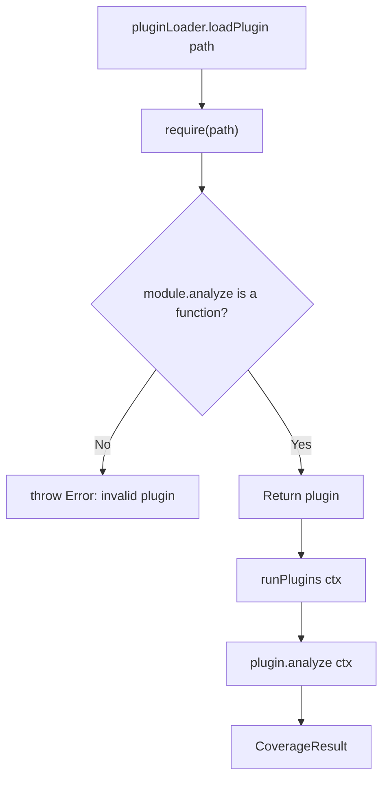

# Plugin API

This page documents the TypeScript interfaces for the plugin system.

## `Plugin` interface

```typescript
/**
 * A coverage analyzer plugin.
 * Export an object matching this interface from your plugin file.
 */
interface Plugin {
  /**
   * Perform coverage analysis.
   * Called once per coverage command run.
   *
   * @param context - Runtime context provided by the analyzer
   * @returns A CoverageResult describing the plugin's findings
   */
  analyze(context: PluginContext): Promise<CoverageResult>
}
```

## `PluginContext` interface

```typescript
interface PluginContext {
  /** Parsed OpenAPI spec (output of @apidevtools/swagger-parser) */
  spec: object

  /**
   * Glob patterns used to locate test files.
   * Pass these directly to fast-glob.
   */
  testPatterns: string[]

  /** Coverage results from the built-in analysis engines */
  results: CoverageResult[]

  /** Fully resolved configuration (file + CLI flags merged) */
  config: CoverageConfig
}
```

## `CoverageResult` interface

```typescript
interface CoverageResult {
  /**
   * Unique identifier for this coverage type.
   * Use a short lowercase slug, e.g. "graphql", "grpc", "websocket".
   */
  type: string

  /** Total number of items discovered (endpoints, fields, rules, etc.) */
  totalItems: number

  /** Number of items covered by tests */
  coveredItems: number

  /** Coverage percentage, 0–100 */
  coveragePercent: number

  /** Whether the threshold was met (set by the framework if a threshold is configured) */
  thresholdPassed?: boolean

  /** Type-specific details, included verbatim in JSON/HTML reports */
  details: Record<string, unknown>
}
```

## `CoverageConfig` interface

```typescript
interface CoverageConfig {
  thresholds: {
    endpoint?: number
    parameter?: number
    business?: number
    integration?: number
    security?: number
    error?: number
    performance?: number
    resilience?: number
    [key: string]: number | undefined
  }
  exclude: {
    paths?: string[]
    methods?: string[]
  }
  testPatterns?: string[]
  plugins?: string[]
}
```

## Example plugin (TypeScript)

```typescript
// plugins/my-plugin.ts
import type { PluginContext, CoverageResult } from '../src/pluginLoader'
import * as fs from 'fs'
import glob from 'fast-glob'

export async function analyze({ testPatterns, config }: PluginContext): Promise<CoverageResult> {
  const cwd = process.cwd()
  const allItems = ['feature-a', 'feature-b', 'feature-c']

  const testFiles = await glob(testPatterns ?? ['tests/**/*.ts'], { cwd, absolute: true })
  const contents = testFiles.map(f => {
    try { return fs.readFileSync(f, 'utf-8') } catch { return '' }
  })

  const covered = allItems.filter(item =>
    contents.some(c => c.includes(item))
  )

  return {
    type: 'my-feature',
    totalItems: allItems.length,
    coveredItems: covered.length,
    coveragePercent: allItems.length > 0
      ? parseFloat(((covered.length / allItems.length) * 100).toFixed(2))
      : 0,
    details: {
      items: allItems.map(id => ({ id, covered: covered.includes(id) }))
    }
  }
}
```

Compile with `tsc` and reference the compiled `.js` file in `coverage.config.json`.

## Plugin loading mechanism



## See also

- [Extending via Plugins →](../guide/plugins.md)
- [Configuration Schema →](./configuration.md)
